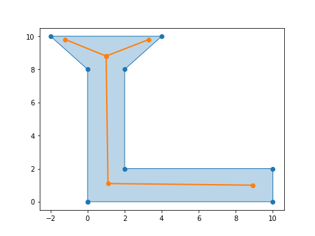

.. currentmodule:: pygeoops

User guide
==========

PyGeoOps provides some less common or extended spatial algorithms and utility functions.

A full list of functionalities can be found in the 
:ref:`API reference<API-reference>`. 

As a quick start, here are some examples on how PyGeoOps can be used.

Determine a centerline for a list of shapely polygons
-----------------------------------------------------

.. code-block:: python

    polygons = [
        shapely.from_wkt("POLYGON ((0 0, 0 8, -2 10, 4 10, 2 8, 2 2, 10 2, 10 0, 0 0))"),
        shapely.from_wkt("POLYGON ((0 0, 0 8, -2 10, 4 10, 2 8, 2 2, 10 2, 10 0, 0 0))"),
    ]
    centerlines = pygeoops.centerline(polygons)

|centerline_L_shape|

Determine view angles for a viewpoint towards a geopandas GeoDataFrame
----------------------------------------------------------------------

.. code-block:: python
    
    viewpoint = shapely.Point(10, 20)
    polygons = [
        shapely.from_wkt("POLYGON((1 0, 1 1, 2 1, 2 0, 1 0))"),
        shapely.from_wkt("POLYGON((-1 0, -1 1, -2 1, -2 0, -1 0))")
    ]
    visible_geoms_gdf = geopandas.GeoDataFrame(geometry=polygons)
    )
    angles_df = pandas.DataFrame(
        pygeoops.view_angles(viewpoint, visible_geoms_gdf.geometry.values),
        columns=["angle_start", "angle_end"],
        index=visible_geoms_gdf.index,
    )

